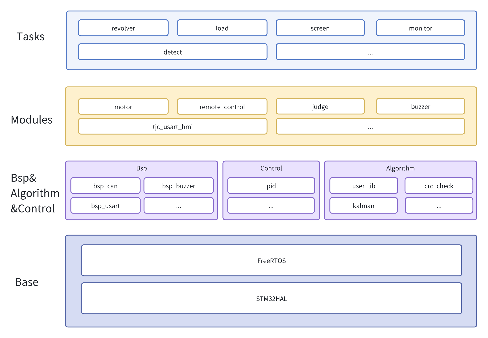
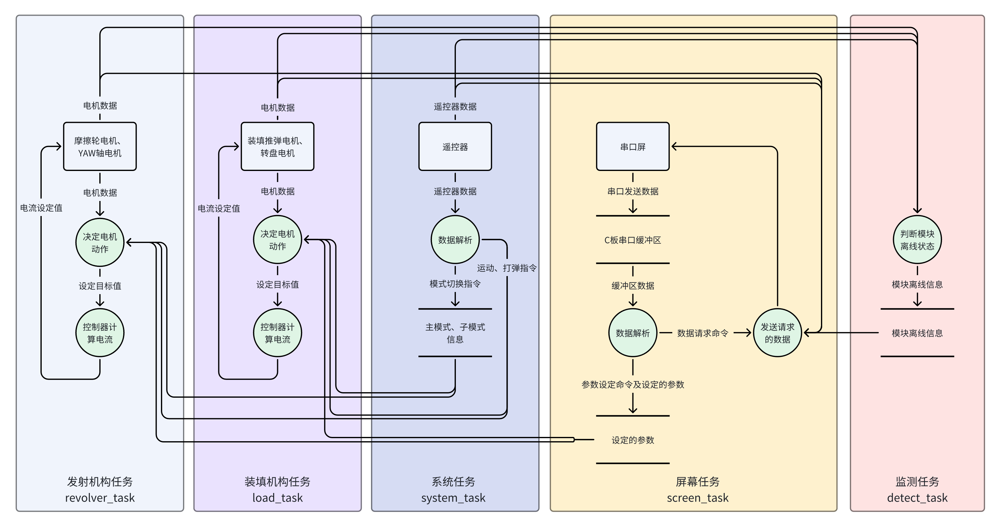
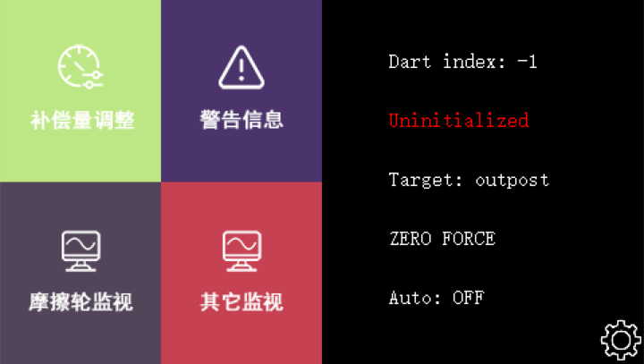
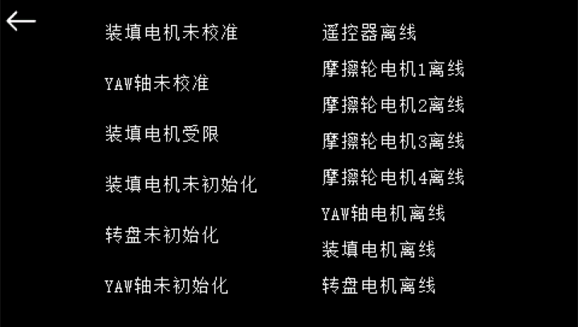
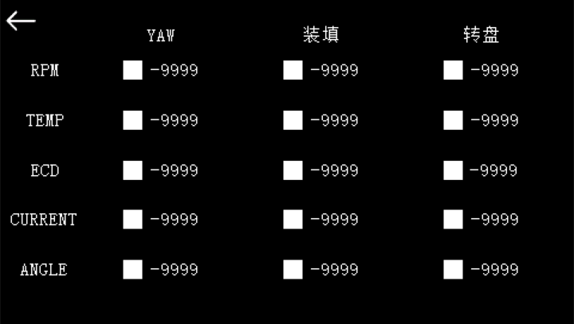

    <h1>TUP_2024_Dart</h1>

# 简介

本项目是TUP战队2024赛季飞镖发射架的电控代码。基于2023赛季的旧C++框架编写，应用层具备良好的扩展性。底层的bsp、device等代码的结构并非完美，但应用层在编写时贯彻了C++面向对象的编程思想，类间的嵌套对应到发射架相应的机构，逻辑明确，易于理解。代码在设计时对大部分操作都做好了防误触保护，包含大量的遥控器内八外八打杆方式，保证了调试和比赛时的人员及结构安全。发射架包含一个串口屏调参模块，可实现对参数的快速更改和对发射架重要数据的监视，即使不携带电脑也能正常进行飞镖测试，在发射架出现异常时也可根据监视的数据快速诊断问题所在，大幅提升了调试的便捷性。发射架的运行不依赖裁判系统串口数据，可避免裁判系统数据延迟等带来的潜在问题。

# 运行环境

RoboMaster C型开发板

# 开发环境

开发工具：uVision V5.29.0.0、Visual Studio Code 1.93.1、Visual Studio Code扩展Keil Assistant 1.7.0

调试工具：Ozone V3.30a

# 系统架构

底层基于HAL库搭建，采用了FreeRTOS操作系统调度不同的任务。BSP层是针对RoboMaster C型开发板的主控芯片STM32F407IGH6开发的板级支持包，用于调用开发板上不同硬件模块。Control层是控制器算法。Algorithm层是数学算法库。Modules层提供了发射架各模块的驱动文件。Tasks应用层采用C++编写，充分利用了C++的面向对象特性，使代码逻辑清晰，容易开发和维护。system任务控制系统主模式、子模式的切换，以及对多个任务的共用数据的处理，revolver任务控制摩擦轮、YAW轴，load任务控制装填推块、转盘，screen任务控制串口屏的通信，monitor任务控制蜂鸣器、led灯，detect任务检测各模块的在线状态。

本项目的目录结构存在少量缺陷，例如将滤波和控制器算法归类到了Math中，将AHRS、Mahony归类到了Algorithm中，但更好的归类方式是Control用于存放控制器，Algorithm用于存放数学算法。为便于理解程序结构，架构图中对此进行了优化。

# 数据流

数据流如下图所示。程序运行时监测任务将实时检测各模块是否离线，并存储离线信息至内存中。用户在串口屏上设定参数后，参数会发送到开发板中，如果在串口屏上开启监视数据，则开发板会向串口屏发送各机构的数据以及离线信息并显示在串口屏上。用户在遥控器上执行操作后，程序将根据当前主模式、子模式、输入的指令及设定好的参数信息决定各电机的动作，并通过控制算法计算出各电机所需的电流值发送给电机执行相应动作。

# 操作说明

使用遥控器和串口屏协同操作才可以完整控制飞镖发射架，遥控器控制飞镖发射架的运行模式、运行行为，串口屏调整飞镖发射架内部参数、监视运行中的各项数据。

## 遥控器

遥控器的右拨杆控制主模式，左拨杆控制子模式。除无力模式外，每个主模式下都有三个子模式。

### 模式总览

<table>
    <tbody>
        <tr>
            <td class>右拨杆</td>
            <td class>左拨杆</td>
            <td class>主模式</td>
            <td class>子模式</td>
        </tr>
        <tr>
            <td class>下</td>
            <td class>-</td>
            <td class>无力模式</td>
            <td class>-</td>
        </tr>
        <tr>
            <td rowspan="3" class>中</td>
            <td class>下</td>
            <td rowspan="3" class>校准模式</td>
            <td class>调整</td>
        </tr>
        <tr>
            <td class>中</td>
            <td class>校准</td>
        </tr>
        <tr>
            <td class>上</td>
            <td class>检查校准点</td>
        </tr>
        <tr>
            <td rowspan="3" class>上</td>
            <td class>下</td>
            <td rowspan="3" class>发射模式</td>
            <td class>发射初始化</td>
        </tr>
        <tr>
            <td class>中</td>
            <td class>手动发射</td>
        </tr>
        <tr>
            <td class>上</td>
            <td class>自动发射</td>
        </tr>
    </tbody>
</table>

### 模式详情

本软件的遥控器操作中包含了大量内八、外八的打杆方式，为方便叙述，下文中左右摇杆同时打杆的操作将以两个连续的箭头表示，例如左摇杆打到左上同时右摇杆打到右上表示为“↖↗”。

<table>
    <thead>
        <tr>
            <td class>主模式</td>
            <td class>子模式</td>
            <td class>功能</td>
            <td class>说明</td>
        </tr>
    </thead>
    <tbody>
        <tr>
            <td class>无力模式</td>
            <td class>-</td>
            <td class>急停</td>
            <td class>
                <ul>
                    <li>摩擦轮使用速度环控制停转，其他电机发送零电流关闭输出</li>
                    <li>程序正常运行时无力模式才能发挥急停功能，当程序运行出错疯车时应直接切断电源</li>
                </ul>
            </td>
        </tr>
        <tr>
            <td rowspan="6" class>校准模式</td>
            <td rowspan="2" class>调整</td>
            <td class>调整装填电机和转盘</td>
            <td class>
                <ul>
                    <li>右摇杆前后调整装填电机位置，左右调整转盘位置</li>
                    <li>装填推块位于载弹架中时，转盘无法转动</li>
                    <li>载弹架的空位没有正对推块时，装填电机无法前移</li>
                    <li>装填电机未校准时，装填电机和转盘无法移动</li>
                </ul>
            </td>
        </tr>
        <tr>
            <td class>调整yaw轴</td>
            <td class>
                <ul>
                    <li>左摇杆左右调整yaw轴</li>
                </ul>
            </td>
        </tr>
        <tr>
            <td rowspan="3" class>校准</td>
            <td class>自动校准装填电机</td>
            <td class>
                <ul>
                    <li>↙↘开始自动校准装填电机，滑块会自动下移寻找零点，接触到触点开关后上移一定距离，完成校准</li>
                    <li>底部触点开关被压下时会有蜂鸣器反馈</li>
                    <li>若滑块下移至最底部还不自动上移，说明触点开关相关线路工作不正常，请立即退出校准模式防止损伤机械结构</li>
                </ul>
            </td>
        </tr>
        <tr>
            <td class>手动校准装填电机</td>
            <td class>
                <ul>
                    <li>↘↙保持，进行手动校准，以当前位置作为滑块零点，听到蜂鸣器响完成校准</li>
                    <li>拨杆拨动到校准位置（--），手动拖动推块至最底部，直到触点开关被压下，然后手动转动装填电机转子端使推块上移至刚好离开触点开关金属片的位置（不是刚好使触点开关弹起的位置），此时的位置可作为零点
                    </li>
                    <li>手动校准后必须用遥控器控制转盘旋转，检查弹仓是否会与推块干涉，若干涉则需要重新校准</li>
                </ul>
            </td>
        </tr>
        <tr>
            <td class>校准yaw轴</td>
            <td class>
                <ul>
                    <li>↗↖校准yaw轴，以当前位置作为发射时偏移量的零点，听到蜂鸣器响完成校准</li>
                    <li>校准模式下yaw轴电机不输出扭矩，可在调整模式下先将yaw轴移动到需要校准的位置附近，进入校准模式后用手转动yaw轴转子细调零点</li>
                </ul>
            </td>
        </tr>
        <tr>
            <td class>检查校准点</td>
            <td class>检查校准点</td>
            <td class>
                <ul>
                    <li>↗↖检查校准点，yaw轴会自动返回校准的零点</li>
                </ul>
            </td>
        </tr>
        <tr>
            <td rowspan="5" class>发射模式</td>
            <td rowspan="2" class>发射初始化</td>
            <td class>发射初始化</td>
            <td class>
                <ul>
                    <li>发射初始化有四种打杆方式，可以选择从四发飞镖中的第几发开始发射。初始化时装填电机退回零点，转盘转动将指定的飞镖移动至发射轨道上，yaw轴移动至指定飞镖对应的前哨站偏移量</li>
                    <li>↗↖初始化为第一发飞镖</li>
                    <li>↖↖初始化为第二发飞镖</li>
                    <li>↙↖初始化为第三发飞镖</li>
                    <li>↘↖初始化为第四发飞镖</li>
                    <li>无论左右拨杆，离开再重新回到发射初始化模式后，都需要重新初始化</li>
                </ul>
            </td>
        </tr>
        <tr>
            <td class>开启摩擦轮</td>
            <td class>
                <ul>
                    <li>↖↗开启摩擦轮，摩擦轮将以初始化的飞镖对应的前哨站设定转速旋转，若未初始化则以第一发飞镖的前哨站设定转速旋转</li>
                    <li>离开发射模式主模式（右拨杆上）后，摩擦轮自动停止。发射模式主模式下，离开再重回发射初始化模式或所有飞镖打空后，摩擦轮自动停止</li>
                </ul>
            </td>
        </tr>
        <tr>
            <td rowspan="2" class>手动发射</td>
            <td class>发射飞镖</td>
            <td class>
                <ul>
                    <li>左摇杆向↖打一次发射一枚飞镖，发射架将执行：装填推块推动飞镖上移发射→装填推块下移返回零点→摩擦轮转速变为下一发飞镖对应的设定转速→转盘转动将下一发飞镖移动至发射轨道上→yaw轴移动至下一发飞镖对应的设定位置（为了节省装弹时间，部分步骤会同时进行）（后续将此简称为“发射流程”）。完成以上所有步骤后，发射架才会对遥控器打杆再次做出响应，发射下一发飞镖。
                    </li>
                    <li>需要连续发射四发飞镖时左摇杆可一直保持↖状态，不必反复回中</li>
                    <li>不开启摩擦轮时也能进行发射流程，可用于模拟推弹检查各机构运行是否正常</li>
                    <li>未完成发射初始化时无法进行发射流程</li>
                </ul>
            </td>
        </tr>
        <tr>
            <td class>切换打击目标</td>
            <td class>
                <ul>
                    <li>↙↙设置未发射的飞镖打击目标为前哨站，↘↘设置未发射的飞镖打击目标为基地，未设置目标则默认为前哨站</li>
                    <li>每次进入发射模式主模式（右拨杆上）或发射初始化子模式，打击目标都会被自动重置为前哨站</li>
                </ul>
            </td>
        </tr>
        <tr>
            <td class>自动发射</td>
            <td class>发射飞镖</td>
            <td class>
                <ul>
                    <li>左摇杆向↖打一次发射一枚飞镖，发射架在执行发射流程前后将自动控制摩擦轮启停，即：摩擦轮开启→发射流程→摩擦轮停止</li>
                    <li>需要连续发射多发飞镖时左摇杆可一直保持↖状态，不必反复回中，每发飞镖之间摩擦轮不会再停止</li>
                    <li>自动发射会自动控制摩擦轮启停，无需在发射初始化时开启摩擦轮</li>
                    <li>未完成发射初始化时无法进行自动发射</li>
                </ul>
            </td>
        </tr>
    </tbody>
</table>

## 串口屏

本程序可与烧录了配套程序的淘晶驰T1系列4.3寸IPS电容屏模块通信进行可视化的便捷调参和数据监视。

### 主页

- 主页左半部分为串口屏四大功能，点击即可进入相应页面。

- 右半部分显示发射架的几项重要信息，自上而下具体如下：

  - 飞镖索引：可理解为已经发射的飞镖数量

  - 发射初始化状态：未进行发射初始化时显示红色的Uninitialized，初始化完毕后显示白色的Initialized

  - 打击目标：前哨站（outpost）或基地（base）

  - 发射架主模式：根据遥控器右拨杆设置的发射架主模式，会显示为ZERO FORCE（无力模式）、CALIBRATE（校准模式）、SHOOT（发射模式）

  - 自动发射：发射架处于自动发射状态（↑↑）时显示Auto: ON，否则显示Auto: OFF

### 补偿量调整

右上角为刷新按键，点击可获取C板内存储的所有补偿数据并在本页面显示。右下角为跳转至摩擦轮监视页面的快捷按键。下方数字一至四行表示第一至第四发飞镖的四项参数。

点击想要更改的数据可使用弹出的小键盘进行更改，摩擦轮转速必须为整数，yaw轴补偿可以为小数。输入完数据按OK后，检查本页面显示的数据是否与在小键盘中输入的相同，如果不相同说明C板没有成功接收到输入的数据，需要重新输入。输入完所有数据后，点击几次刷新键检查本页面显示的数据是否都与预期的一致，出现不一致的数据需要重新输入。

### 警告信息

本页面左半部分显示发射架各模块的初始化及校准警告，其中装填电机受限表示载弹架的空位没有正对装填推块，推块受限无法前移。右半部分显示各模块的离线警告。出现警告时本页面显示对应的文字提示，警告消除时文字消失。在完成发射初始化准备发射时，应确保本页面不显示任何警告信息。

### 摩擦轮监视

本页面可监视四个摩擦轮电机的各项数据，右下角为跳转至补偿量调整页面的快捷按键。RPM为电机转速，TEMP为电机温度，ECD为电机编码器值，CURRENT为电机反馈电流。被复选框勾选的数据将以1.25Hz的频率进行更新，勾选的数量不会影响数据的刷新率，但串口屏性能有限，勾选过多的数据可能导致爆栈白屏。爆栈后将串口屏断电重启即可恢复。

### 其它监视

本页面可监视yaw轴、装填、转盘电机的各项数据，操作逻辑和注意事项与摩擦轮监视页面相同。ANGLE为电机编码值相对于零点编码值的角度。yaw轴电机和装填电机的ANGLE为无效数据，即使勾选也不会刷新。

## 操作流程

为方便叙述，下文中将使用两个连续的上下箭头或横杠标记操作时遥控器左右拨杆的状态，例如左拨杆拨到中同时右拨杆拨到下表示为“-↓”。

1. 开启遥控器并将拨杆打到无力模式（↓↓），给发射架上电
2. 校准装填电机（--）
3. 移动yaw轴使激光点瞄准前哨站（↓-）
4. 校准yaw轴（--）
5. 在串口屏上输入各个镖体的补偿参数
6. 发射初始化（↓↑）
7. 检查串口屏是否有警告信息
8. 发射飞镖（-↑或↑↑）

# 部分故障及原因

| 故障表现                              | 原因                                    |
| ------------------------------------- | --------------------------------------- |
| 串口屏主页飞镖索引长时间显示-1        | 通信异常，串口屏无法接收到C板发送的数据 |
| 串口屏补偿量调整页面所有数据显示99999 | 通信异常，串口屏无法接收到C板发送的数据 |

# 配件选型

## 发射架

| 配件         | 型号                           |
| ------------ | ------------------------------ |
| 摩擦轮电机   | RoboMaster M3508转子端         |
| YAW轴电机    | RoboMaster M3508               |
| 转盘电机     | RoboMaster GM6020              |
| 装填电机     | RoboMaster M2006               |
| 开发板       | RoboMaster开发板 C 型          |
| 串口屏       | 淘晶驰T1系列4.3寸IPS电容屏模块 |
| 激光器       | RoboMaster 红点激光器          |
| *OLED屏      | 0.96寸                         |
| YAW轴拖链    | 10*20                          |
| 装填电机拖链 | 10*10                          |
| 24V电源线    | 18AWG硅胶线                    |
| 5V电源线     | 26AWG硅胶线                    |
| 信号线       | 26AWG硅胶线                    |
| 温湿度计     | 德力西DM-1059                  |
| 扎带固定座   | 可调式扎带固定座 CL-2          |

*截至此文档创建时，发射架的OLED屏已被串口屏替代不再使用，但程序中仍保留有相关代码，方便根据需求重新启用

## 飞镖

| 配件           | 型号              |
| -------------- | ----------------- |
| 电池           | 3.7V 402030锂电池 |
| 电池端供电插头 | SH1.0             |

# 电机ID配置

| 电机       | 型号   | CAN总线 | ID   |
| ---------- | ------ | ------- | ---- |
| 左前摩擦轮 | M3508  | CAN1    | 1    |
| 右前摩擦轮 | M3508  | CAN1    | 2    |
| 左后摩擦轮 | M3508  | CAN1    | 3    |
| 右后摩擦轮 | M3508  | CAN1    | 4    |
| YAW轴      | M3508  | CAN2    | 1    |
| 转盘       | GM6020 | CAN2    | 1    |
| 装填推块   | M2006  | CAN2    | 6    |

# 布线规范

# 程序设计思路

# 调参方法

# AI文档